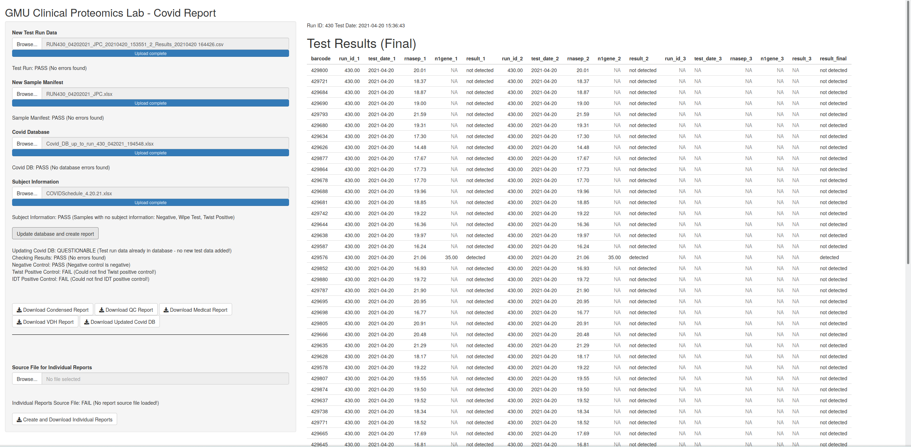

# Covidreporter

COVID-19 PCR testing analysis, data management, and clinical report creation at the George Mason University Clinical Proteomics Laboratory.

## Introduction

This software accompanies a Laboratory Developed COVID-19 PCR Test set up in the CAP/CLIA accredited Clinical Proteomics Laboratory (CAP Number: 7223012; CLIA License: 49D2002076) at George Mason University. This test detects the N1 gene of SARS-CoV-2 in saliva specimens by extraction-free nucleic acid amplification probe detection, performed on a ThermoFisher QuantStudio 7 Pro RT-PCR instrument. The control gene in this assay is the
human RNase P gene.

This test has been used by the George Mason University Athletics Department since the fall of 2020 for athlete COVID-19 surveillance. In addition, this test is used as backup for GMU student/staff surveillance testing.

<!---->
**Samples Analyzed to date: 54293**

Due to a lack of HIPAA compliant infrastructure availability at the time of development, and to accomodate the experience of end users with excel, this app requires that data files be shared manually between users instead of being hosted as a database online.

**App Features:**

* maintain repository of all data created using the COVID-19 PCR assay
* calculate sample results
* export results in condensed format for GMU Athletics Department
* export results in extended format for QC purposes
* export results in Medicat format for automatic integration into the GMU Medicat system
* export results in Virginia Department of Health compliant format for reporting results to the state health department
* export individual clinical reports per participant as pdf

## Table of Content

* [Technologies](#technologies)
* [Installation](#installation)
* [Howto](#howto)
	* [Import Data and Create Results](#import-data-and-create-results)
	* [Export Summary Reports](#export-summary-reports)
	* [Export Individual Clinical Reports per Subject](#export-individual-clinical-reports-per-subject)

## Technologies

<!--
-->

* R 4.05
* Shiny 1.6.0

## Installation

1. Clone github project.

2. Start the app:
    *  Linux: Open the server.R file in RStudio and click "Run App".
    *  Windows: Either load server.R in RStudio and click "Run App", or adjust the provided covidreporter_igg_batch_template.bat batch file to enable double-clicking an icon on your desktop to start.

## Howto

### Import Data and Create Results

1. Select the appropriate data files and verify that each file passes QC:
   * "New Test Run Data" (the result file from the QuantStudio 7 instrument)
   * "New Sample Manifest" (the sampe manifest corresponding with this particular run)
   * "Covid Database" (the excel file containing all previous data)
   * "Subject Information" (the file linking barcodes with individual subject information)

2. Click on “Update database and create report”

3. Ensure all data was imported and analyzed correctly
   * A QC item will appear on the bottom left for each file (below the “Download…” buttons).
   * The new test run ID and test date will be displayed at the top of the window on the right.
   * The new test results will be displayed in the main panel, separated into a table with final information (top) and preliminary information (bottom).

### Export Summary Reports

Click on the respective “Download…” buttons to save the:
   * “…Condensed Report” (the file that is uploaded to the GMU Athletics Department)
   * “…QC Report” (the same result information visible on the screen, separated into a “final” and “preliminary” worksheet (this will help identify the samples to repeat)
   * “…Medicat Report” (the file that will be imported into Medicat)
   * “…VDH Report” (the file that will be uploaded to the Virginia Department of Health)
   * “…Updated Covid DB” (the newly updated database file)

### Export Individual Clinical Reports per Subject

1. Select the appropriate input file, listing the results to be turned into clinical reports.
   * This file has the same format as the "Condensed Report" (see above).

2. Click on "Create and Download Individual Reports".
   * A clinical report will be created for each selected sample/participant combination. Reports are in pdf format.
   * A small indicator window on the bottom right will show the name of the participant for whom a report is currently created. Depending on the number of participants, this may take a few seconds.
   * After completing all reports, a zip file containing all reports can be saved.
